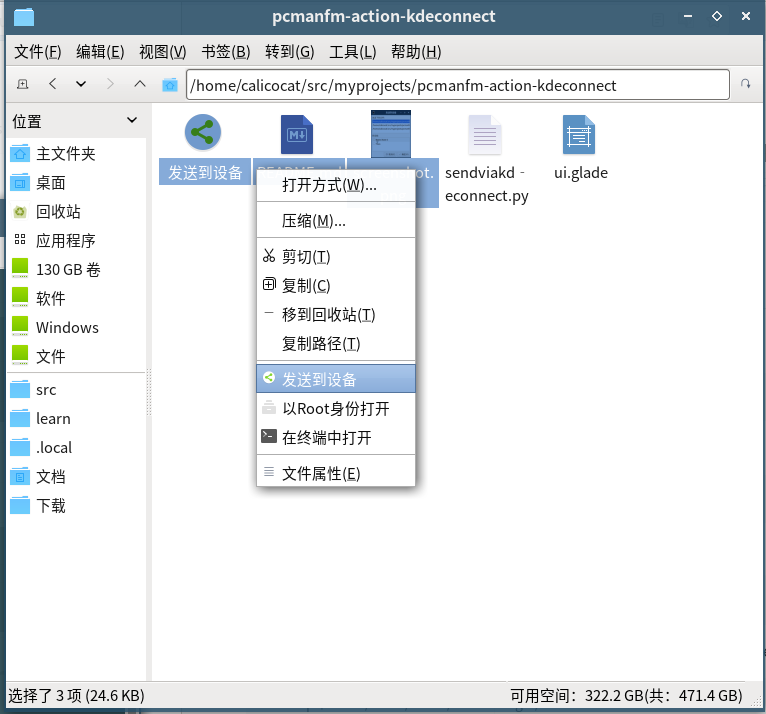
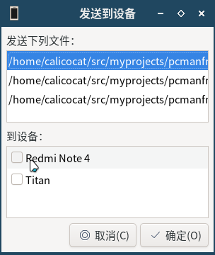

# pcmanfm-action-kdeconnect

Add "Send via KDE Connect" to the right-click menu of PCManFM

添加“发送到设备”到 PCManFM 的右键菜单

## Installation / 安装

Clone or download this repository

克隆或下载这个储存库

```
git clone https://github.com/calico-cat-3333/pcmanfm-action-kdeconnect.git
```

Install dependencies

安装依赖

```
sudo apt install python3-gi
```

Add executable premission to `sendviakedconnect.py` and copy it to `~/.local/bin` or another directory in your `$PATH`

为 `sendviakdeconnect.py` 添加可执行权限并复制到 `~/.local/bin` 或者在 `$PATH` 中的任何目录

```
chmod +x sendviakedconnect.py
cp sendviakedconnect.py ~/.local/bin/
```

Copy `SendViaKdeconnect.desktop` to `~/.local/share/file-manager/actions`

复制 `SendViaKdeconnect.desktop` 到 `~/.local/share/file-manager/actions`

```
mkdir -p ~/.local/share/file-manager/actions/
cp SendViaKdeconnect.desktop ~/.local/share/file-manager/actions/
```

## Screenshot / 截图

 
